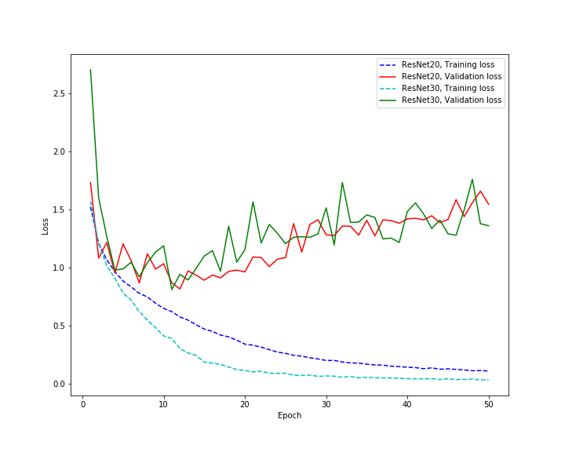

# Keras-ResNet
ResNet that implements the activation function with LeakyReLU
(Update still in progress)

# CIFAR 10 Graph
  Batch Size : 32
  Epoch : 50
  Optimizer : Adam
  Learning Late :  0.001
  
  
